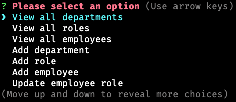

# Employee Tracker


## Description

A simple employee tracking Node CLI app using Inquirer and MySQL.

A walkthrough demo can be found [here](https://drive.google.com/file/d/1bO23ipo907CvzWbGw0obaRPJLUPV5n2r/view)

## Table of Contents

* [Installation](#Installation)
* [Usage](#Usage)
* [Contribution](#Contribution)
* [License](#License)
* [Questions](#Questions)

## Installation

```terminal
# install all dependencies
npm i

# open the mysql shell and source the db schema
SOURCE db/schema.sql
SOURCE db/seeds.sql # optional
```

## Usage

```terminal
npm start
```

Select an option from the CLI prompt:



## Contribution

Fork repo and create a pull request

## License

This project is covered under the MIT License

## Questions

* Email: [contact@furhan.dev](contact@furhan.dev)
* GitHub: [furhan-dev](https://github.com/furhan-dev)
